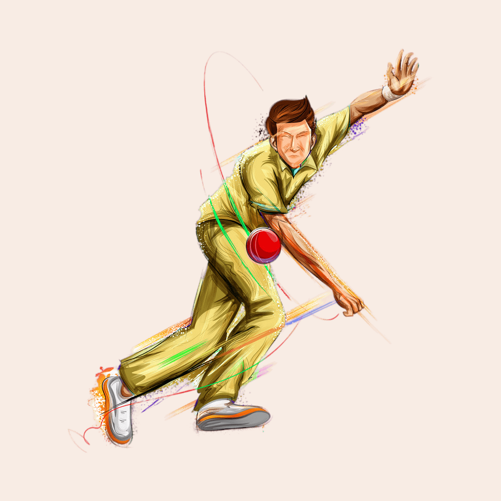

# CricOzy
<!DOCTYPE html>
<html>
<head>
	<title>CricOzy</title>
	
</head>
<body>

	<h1>CricOzy</h1>

	
Welcome to CricOzy, a completely free Flutter Dart-based UI template for everyone. With its sleek design and intuitive user interface, CricOzy is perfect for anyone looking to create a sports or gaming app.

	

	<!-- <h2>Example Animations</h2>
	
Check out this example animation to see what you can achieve with CricOzy:

	

	
We hope you enjoy using CricOzy to create stunning sports and gaming apps. If you like this project, consider buying us a coffee using the button above. Thank you for your support!
 -->

</body>
</html>

# CricOzy_Front-End
# CricOzy-Front-End
